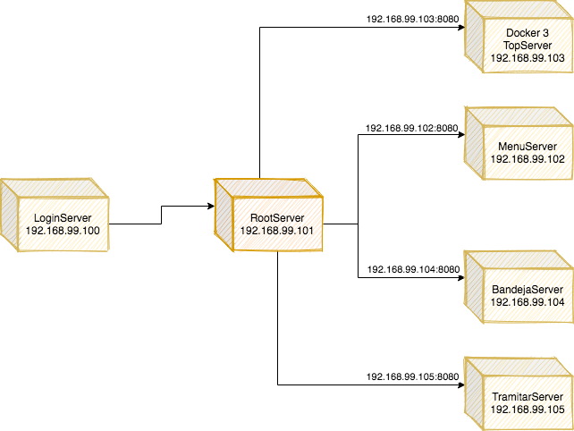
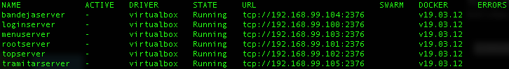

# ContenedoresSPAs

Prueba de concepto de contenedores para SPAs

El objetivo de este repositorio es:

- Documentar la configuración de los contenedores docker
- Documentar acerca de comandos útiles de Docker

## Diagrama de Despliegue

## Ambientación

Para tener el ambiente se necesita:
- Crear contenedor
- Bajar la imagen preconfigurada de un servidor web Apache2 en el contenedor
- Copiar la aplicación web en el contenedor

### Crear contenedores

``docker-machine create --driver virtualbox 'rootserver'``

- Recordar que hay que crear un contenedor por cada aplicación

``docker-machine create --driver virtualbox 'loginserver'``

``docker-machine create --driver virtualbox 'rootserver'``

``docker-machine create --driver virtualbox 'menuserver'``

``docker-machine create --driver virtualbox 'topserver'``

``docker-machine create --driver virtualbox 'bandejaserver'``

``docker-machine create --driver virtualbox 'tramitarserver'``

- Luego configurar el ambiente

``docker-machine env nombreContenedor ``

- Las ips deberían ser algo como esto:
	- loginserver: 192.168.99.100
	- rootserver: 192.168.99.101
	- menuserver: 192.168.99.103
	- topserver: 192.168.99.102
	- bandejaserver: 192.168.99.104
	- tramitarserver: 192.168.99.105

### Bajar la imagen de contenedor Apache

- [https://hub.docker.com/_/httpd]()
- Se debe bajar esto en cada uno de nuestros contenedores

``docker pull httpd``

#### Revisar datos del contenedor

``docker-machine ip nombreMaquina``

``eval "$(docker-machine env nombreMaquina)"``

- La IP es la que se usará para conectarse con las aplicaciones en la aplicación root o contenedora.

#### Revisar todos los contenedores locales

``docker-machine ls``

### Copiar la aplicación web

- Seguir con el siguiente apartado

## Aplicaciones web

### Bajar repositorios y compilar

- Revisar repositorio de aplicaciones [https://github.com/hernanBeiza/MultiplesSPAs](https://github.com/hernanBeiza/MultiplesSPAs)

### Desplegar

- Compilar cada aplicación usando ``npm run build``
- Copiar cada aplicación compilada (dist/**NombreApp**) en la carpeta public de cada contenedor, respetando /public-html/**NombreApp**

- Revisar archivo Dockerfile: En él se encuentran las instrucciones para configurar el contenedor y copiar los archivos de la aplicación web

- Ejecutar archivo bash ``up.sh``: Este archivo se encarga de bajar y levantar la imagen de apache y ponerla en funcionamiento

- Revisar la ip del contenedor, incluyendo el puerto del servicio :8080

- Visitar las aplicaciones en el navegador. La aplicación contenedora debería mostrar menu y top la primera vez que se visita

- Las aplicaciones hijas, tramitar y bandeja, no se desplegarán en el navegador, pero mostrarán un mensaje en la consola si están bien desplegadas en el contenedor: Esto se debe a que se despliegan para ser visitas desde la aplicación root o contenedora

## Tecnologías usadas

- Docker
- Bash
- Angular 8
- single-spa-layout: "^1.0.0-beta.2"
- single-spa: "^5.3.1"
- webpack: "^4.41.2"
- webpack-cli: "^3.3.10"
- webpack-config-single-spa-ts": "^1.4.2"
- Node 12.13.1
- Npm 6
- Virtualbox 5.2

## Comandos básicos docker

### Crear contenedor

``docker-machine create --driver virtualbox 'nombreContenedor'``

### Configurar ambiente 

``docker-machine env nombreContenedor ``

### Listar contenedores

``docker-machine ps``

### Obtener ip

``docker-machine ip <nombreContenedor>``

### Listar contenedores locales

``docker-machine ls``

### Listar imágenes locales

``docker images``

### Levantar contenedor

``docker-machine start nombreContenedor``

### Comandos

``docker-machine``

### Tutorial

- [https://github.com/docker/labs/tree/master/beginner/chapters]()